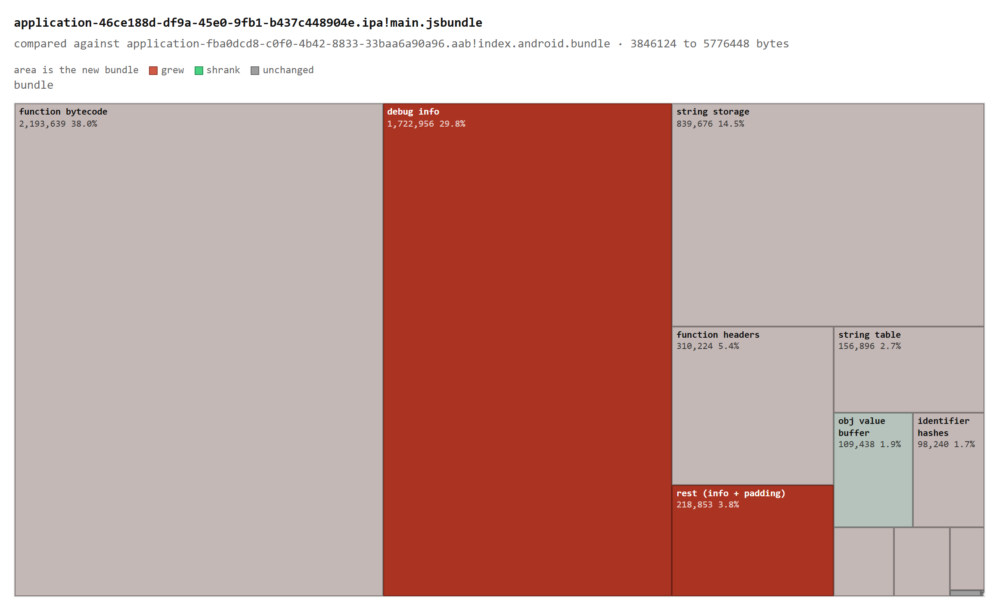
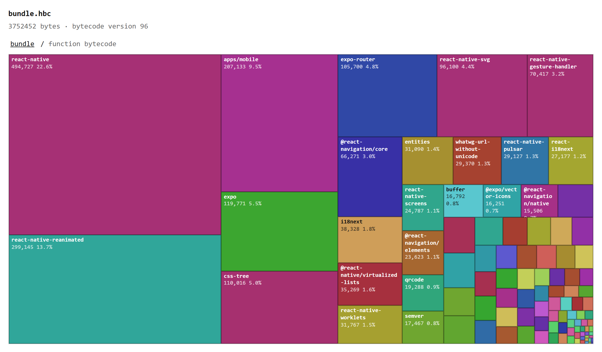

# hermes-bundle-forensics

`hbcinfo` reads a Hermes bytecode bundle, from an `.apk`, `.aab`, `.ipa` or a
raw `.hbc`, and tells you where its bytes went.

It found this comparing the Android and iOS artifacts of one shipped app:

```
  debug info                         28      1722956   +1722928
```

The iOS bundle is 1.93 MB larger, and **1.72 MB of that is Hermes debug info the
release build kept**. The behaviour is documented and this tool did not discover
it; what was missing is any way to see how much, on your bundle. The mechanism,
and why it is a platform default rather than anyone's mistake, is
[further down](#why-ios-ships-debug-info-and-android-does-not).

Measured on real store artifacts, the asymmetry holds across bytecode lines:

| bundle | bytecode | Android | iOS | share of the iOS bundle |
|---|---|---|---|---|
| Sintonia | 96 | 28 bytes | 1,722,956 bytes | |
| My Whisky | 98 | 16 bytes | 1,219,676 bytes | 15.0% |
| **a stock `expo prebuild` app, nothing configured** | 98 | | 314,889 bytes | **16.9%** |

On My Whisky the debug info is **80% of the entire iOS-versus-Android size
difference**: the two bundles differ by 1,524,560 bytes and 1,219,660 of those
are this one section.

The third row is the one that matters. It is a template app created with
`npx expo prebuild` and built with `xcodebuild`, with nothing configured by
anyone. This is not a misconfiguration in someone's project; it is what the
default does.



Same data as the table above, from `hbcinfo --html`. Area is the iOS bundle,
colour is the change against Android, and the section that should be 28 bytes is
the second largest thing in the file.

## Install

Prebuilt binaries for linux, macOS and Windows, on x86_64 and aarch64, are on
the [releases page](https://github.com/brunozampirom/hermes-bundle-forensics/releases).
Each release ships a `SHA256SUMS` file.

```sh
tar -xzf hbcinfo-v0.1.0-aarch64-macos.tar.gz
./hbcinfo-v0.1.0-aarch64-macos/hbcinfo app-release.aab
```

## Usage

```
hbcinfo [options] <file> [file-b]

  --top N        list the N largest functions and strings (default 10, 0 skips)
  --entry PATH   which bundle to read, when a container holds several
  --entry-b PATH same, for the second file in a diff
  --html PATH    write a treemap of the bundle to PATH as one html file
  --budget PATH  check section sizes against a budget file; over exits 1
  --sourcemap P  attribute bytecode to modules using a composed source map
  --list         list the bundles in a container and exit
```

Containers are detected by the `PK\x03\x04` signature, not by extension. A
container holding several bundles (split APKs, multi-module AABs) is an error
rather than a silent pick, since which one the numbers describe would otherwise
be a guess.

## What it reports

```
$ hbcinfo --top 5 app-release.aab
file             app-release.aab!base/assets/index.android.bundle
size             3846124 bytes
version          96
source hash      693b31b7a9443b1157c95ef47b4d5e85c7d2fc8e
options          staticBuiltins=false cjsResolved=false hasAsync=false

counts
  functions          19360
  strings            39148  (identifiers 24540, overflow 305)
  bigints            0
  regexps            279
  CJS modules        0
  function sources   79

functions
  distinct bodies    15305
  bytecode bytes     2191175
  shared bodies      4055 headers reuse a body, saving 80467 bytes
  overflowed headers 4

strings
  storage buffer     838954 bytes
  sum of lengths     1028481 bytes
  packer overlap     189527 bytes saved (18.4%)
  utf-16 strings     808  (63536 bytes, 2 per code unit)
  overflowed entries 305

section map
  header                                  128    0.0%
  function headers                     309760    8.0%
  string kinds                             12    0.0%
  identifier hashes                     98160    2.5%
  string table                         156592    4.0%
  overflow string table                  2440    0.0%
  string storage                       838954   21.8%
  array buffer                          50616    1.3%
  obj key buffer                        46797    1.2%
  obj value buffer                     109440    2.8%
  bigint storage                            0    0.0%
  regexp storage                        26212    0.6%
  function bytecode                   2191175   56.9%
  debug info                               28    0.0%
  footer                                   20    0.0%
  rest (info + padding)                 15790    0.4%

top 5 functions by bytecode size
     58103 bytes  #0       params 1   frame 21   global
     21968 bytes  #18782   params 8   frame 20   (anonymous)
     20587 bytes  #18323   params 8   frame 15   (anonymous)
     11614 bytes  #16274   params 1   frame 89   GameScreen
      8907 bytes  #15901   params 1   frame 60   GameSetupScreen

top 5 strings by size
     30484 bytes  #14803   utf16 ᵁ<Õı...
      7986 bytes  #10373         function decorateAnimation_reactNativeReanimated_utilTs8(ani...
      7240 bytes  #12263         function reactNativeReanimated_springTs2(toValue,userConfig,...
      5021 bytes  #12408         function withStyleAnimation_reactNativeReanimated_styleAnima...
      4761 bytes  #12259         function reactNativeReanimated_springTs1(){const{GentleSprin...
```

Two things in that output are worth a second look.

**`rest` is 0.4%.** Everything else is attributed to a named section, derived
from the file rather than estimated. When a number here is wrong it is wrong
loudly, not quietly folded into a remainder.

**The largest strings are Reanimated worklets**, shipped as their own source
text so the UI-thread runtime can re-evaluate them. That is how the library
works, but it means a chunk of the string table is JavaScript source in a
bundle that is otherwise compiled.

## Diffing two bundles

The question teams actually ask is not "how big is this" but "what grew".

```
$ hbcinfo app-release.aab app-release.ipa
```

Sections and counts line up exactly, and the section deltas sum to the total
delta. If they ever stop doing that, something is being double-counted.
Functions are matched by name, which only works for names unique to both
bundles; the report says how many it could not match rather than pretending
the rest vanished.

## The treemap

```sh
hbcinfo --html bundle.html app-release.aab
```

One self-contained file: no CDN, no bundler, no server. It opens offline and
can be attached to a build artifact or a pull request.

This is not a second [Expo Atlas](https://github.com/expo/atlas). Atlas reads
Metro's dependency graph, so it knows which module contributed which JavaScript
and stops where Hermes begins. This starts at the shipped bytecode and has no
idea modules ever existed. The sections it draws, function bytecode, string
storage, the overflow headers, debug info, are the ones Atlas structurally
cannot see. Anyone shrinking a bundle wants both.

Two details in it are not obvious:

**Function tiles are distinct bodies, not headers.** Hermes shares identical
bodies between functions, so drawing one tile per header would invent bytes the
file does not contain. A shared body is drawn once and says how many headers
point at it.

**String tiles are sized by the bytes a string alone keeps alive.** Because
Hermes packs strings with a suffix array, their lengths add up to more than the
buffer holds, so sizing tiles by length would draw children overflowing their
parent. Every byte of storage is instead given to exactly one string, longest
first, and a string fully contained in another correctly costs nothing. The
tiles then sum to the storage the file actually spends.

That reconciliation is a test, not a claim: every node's children sum to the
node, at every level, down to the byte.

### Diffing two bundles visually

```sh
hbcinfo --html grew.html old.aab new.aab
```

Tiles are sized by the new bundle, so they still partition it, and coloured by
the delta. Something the new bundle no longer has is zero bytes and therefore
has no tile, so it is listed under the map rather than dropped from the page.

Entries are matched by name, and names are not unique: 118 of the 301 largest
functions in a real bundle are called `(anonymous)`. Nothing distinguishes them
across builds, so everything sharing a name is summed into one entry labelled
with its count. That is less precise than pretending each one matched, and it
is the only honest option.

The text diff refuses to compare bundles from the two bytecode lines, because
their section tables do not line up. The treemap refuses the same comparison. A
picture of a table the tool declined to print would be worse for being prettier.

## Which modules cost what

```sh
hbcinfo --sourcemap composed.map app-release.aab
```

```
modules
  attributed        2184649 bytes across 1818 modules
  unattributed      184 bytes with no mapping

top 6 modules by bytecode
    102847  /node_modules/expo/virtual/streams.js
     84253  /node_modules/react-native/Libraries/Renderer/implementations/ReactNativeRenderer-prod.js
     82127  /node_modules/react-native/Libraries/Renderer/implementations/ReactFabric-prod.js
     38403  /node_modules/i18next/dist/esm/i18next.js
     27976  /node_modules/css-tree/data/index.js
     25175  /node_modules/react-native-pulsar/src/Presets.ts
```

Attribution reconciles with the section exactly: 2184649 attributed plus 184
with no mapping is the 2184833 the section holds. With `--html` the bytecode
section is drawn by package instead of by function, and a package opens into
its files.



The two lines at the top of that measurement are both React renderers, Fabric
and the old one, together 166 KB of a 3.7 MB bundle.

### What it needs, and what it does not

**The source map, not the bundle's debug info.** Those two are mutually
exclusive: `-output-source-map` is the same flag that strips the debug info,
so a bundle never carries both. The map is the input, which means this works on
a normally configured release build rather than a special one.

It has to be the **composed** map, Metro's merged with Hermes's, which is what
`compose-source-maps.js` produces and what a release uploads for symbolication.
Handed Metro's JavaScript map alone, the tool says so instead of attributing
bytes at random: that map's columns are characters of JavaScript, not bytes of
bytecode.

### Two things that are easy to get wrong

**A function's position in the map is not where its body sits in the file.** It
is the running sum of every function's size in index order. Hermes deduplicates
identical bodies, so in the file several functions share one address, while the
map gives each its own slot. Deriving one from the other by picking a base
offset agrees for the first sixty-odd functions and then drifts.

**Attribution has to be by byte range, not by function.** The global function of
a Metro bundle is 58 KB spanning every module's wrapper. Giving all of it to
whichever module happens to start it is wrong by more than everything else put
together, and it is the difference between the totals reconciling and missing by
58103 bytes.

## Budgets

```sh
hbcinfo --budget budget.txt app-release.aab
```

```
# bytes. a section missing here is not checked
total          = 4_000_000
debug info     = 1024
string storage = 900_000
```

Over budget exits 1, which is the whole point. Budgets are per section rather
than one total, because "the bundle grew 40 KB" is not something anyone can act
on, while "debug info came back" is. The finding this tool was written for is a
section that should be 28 bytes and was 1.7 MB; a total-only budget absorbs
that inside normal release-to-release drift.

A name matching no section fails the run rather than passing quietly. A budget
file that silently checks nothing because of a typo is the failure worth
designing against, since it only shows up as the regression it was meant to
catch.

## Why iOS ships debug info and Android does not

None of that is new behaviour, and this tool did not discover it. Sentry's
[source map docs](https://docs.sentry.io/platforms/react-native/sourcemaps/uploading/hermes/)
state the mechanism plainly: generating Hermes source maps "has a side effect of
striping the debug information, saving it to the source map" (their typo), and
"the debug information included in the Hermes bundle increases the size of the
final shipped bundle". What was missing is any way to see how much, on your
bundle. Metro reports one number per platform and stops there, so a documented
cost stays invisible until something opens the file and counts.

The engine's own forum shows what answering this costs without the file. In
[facebook/hermes discussion #1129](https://github.com/facebook/hermes/discussions/1129),
"How to check if Hermes bytecode bundle contains debug info?", the accepted
answer explains what each `-g` level emits, then concludes that to tell `-g1`
from `-output-source-map` from inside the bundle you "construct an instance of
`Error()` and examine its `.stack` property". That works. It also needs the app
built, installed, running and throwing, and at the end of it you know which mode
you are in but not what it cost you. Reading the header answers both in
milliseconds, before the app exists.

The cause is a default that differs by platform. `-output-source-map` moves the
debug info out of the bundle and into the `.map`, and React Native passes it on
one platform but not the other:

| | flag | debug info in the shipped bundle |
|---|---|---|
| Android, `ReactExtension.kt` | `["-O", "-output-source-map"]`, always | 28 bytes |
| iOS, `react-native-xcode.sh` | `-output-source-map` only when `SOURCEMAP_FILE` is set | everything |

Compiling one file both ways with the same `hermesc` shows the mechanism
directly: 208 bytes of debug info without the flag, 28 with it, and a `.map`
alongside.

So the fix is not to strip anything. Set `SOURCEMAP_FILE` in the iOS build and
you get a source map for symbolication *and* drop the bytes, because Sentry and
Crashlytics read the `.map`, not the section inside the bundle.

It is not universal, though. Anyone who follows the Sentry, Bugsnag or
Crashlytics setup guides sets `SOURCEMAP_FILE` and is already on the other side
of this. The affected set is iOS builds with no source map upload configured,
which is the default rather than the exception.

## Scope

**Bytecode versions 90-99**, across the two lines that are actually in the wild.

`facebook/hermes` main tops out at **96**. React Native does not ship that one:
since Hermes V1 became the default it ships the `static_h` line, which emits
**98** and up. They disagree about more than a version number:

| | classic (90-96) | `static_h` (97+) |
|---|---|---|
| file header | 21 fields | one more, `numStringSwitchImms`, so everything after the object shape table sits four bytes later |
| third literal section | `objValueBufferSize`, a byte count | `objShapeTableCount`, an entry count of 8 bytes each |
| function header entry | 16 bytes | 12 bytes; the word holding `infoOffset` is gone |
| inline function name | 17 bits | **8 bits** |
| overflow offset | `(infoOffset << 16) \| offset` | `(functionName << 24) \| offset` |

That 8-bit name field has a visible consequence: any function whose name is not
in the first 256 strings cannot fit inline, so on a real bundle almost every
header overflows. On a React Native bundle 6667 of 7482 did, and the full size
headers they point at were 12.9% of the file. They get their own row rather
than disappearing into the remainder.

Below 90, fields are missing from the header; the tool refuses rather than
reading garbage.

**Not supported:** delta-prepped bundles (detected and named, not parsed).
Diffing across the two lines is refused, since the section tables do not line
up and a row would be labelled from one side and filled from the other.

To get a 96 bundle out of a recent React Native, build with
`RCT_HERMES_V1_ENABLED=0`.

**Module attribution needs the source map.** Hermes keeps no module boundary in
the bytecode, so `--sourcemap` is not a convenience: without the composed map
there is nothing in the file to attribute against, and the tool reports
sections and functions only.

## Build from source

Requires [Zig](https://ziglang.org/download/) 0.16.0. No other dependencies:
no CMake, no libc, no Visual Studio.

```sh
zig build            # -> zig-out/bin/hbcinfo
zig build test
zig build run -- bundle.hbc
```

## Where the layout comes from

`include/hermes/BCGen/HBC/BytecodeFileFormat.h` in facebook/hermes, read on both
branches: `main` for the classic line and `static_h` for the one React Native
ships. Plus `BytecodeStream.cpp` for section order and alignment. Section order
follows `visitBytecodeSegmentsInOrder()`, and each section is preceded by
`pad(BYTECODE_ALIGNMENT)`, so each starts on the next 4-byte boundary.

Everything is parsed field by field rather than cast from an `extern struct`.
Relying on the compiler's ABI would paper over exactly the layout mismatches
this tool exists to catch, and it would make the supported version range a lie,
since the whole point of that range is that the layout is version-dependent.

Three details in the format are easy to read wrong, and each has its own test:

- A `SmallFuncHeader` that overflows stores the large header's offset split
  across two of its own fields: `(infoOffset << 16) | offset` on the classic
  line, and `(functionName << 24) | offset` on `static_h`, which has no
  `infoOffset` to borrow.
- A string entry with `length == 0xFF` is overflowed, and its `offset` field is
  then an **index into the overflow table**, not a byte offset.
- Summed string lengths exceed the storage buffer on every real bundle. That is
  not corruption: Hermes lays strings out with a suffix array so a string that
  is a suffix of another shares its bytes. Measured at 18.4% above.

## Trade-offs

- **Integer percentages, not floats.** Output is byte-identical on every
  platform, which matters once this gates a bundle-size check in CI.
- **A truncated file is an error, not a warning.** An earlier version printed a
  section map with percentages over 100% for a truncated bundle. Refusing to
  answer beats answering wrong.
- **Deduplicated function bodies are counted once.** Hermes shares identical
  bodies between headers, so summing every function's size overcounts, by
  80 KB on the bundle above.
- **The container path has no unit tests.** Its pure helpers do; the zip reading
  itself is covered by an end-to-end check that reading from a container gives
  output identical to unzipping first. Building zip fixtures in-process was not
  worth the code.
- **Validated on three shipped bundles**, listed below, plus synthetic bundles
  from `hermesc` on both lines. Still not a corpus.

## Generating a test bundle

No fixture is committed; a binary blob in the repo is one more thing to keep
honest. Build one with the Hermes CLI
([releases](https://github.com/facebook/hermes/releases)):

```sh
hermesc -emit-binary -out bundle.hbc app.js
```

Hermes eliminates top-level bindings that are never read, so a synthetic test
file has to keep its values live or the regexp, array and object buffers all
come back zero.
